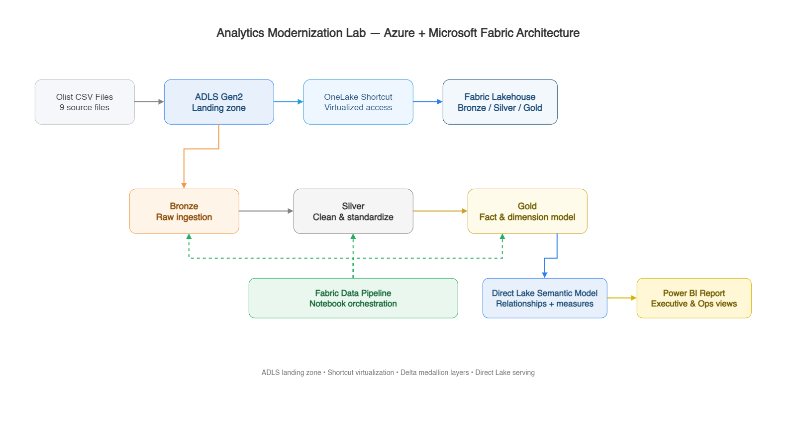
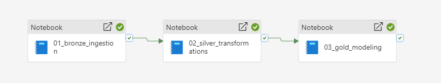
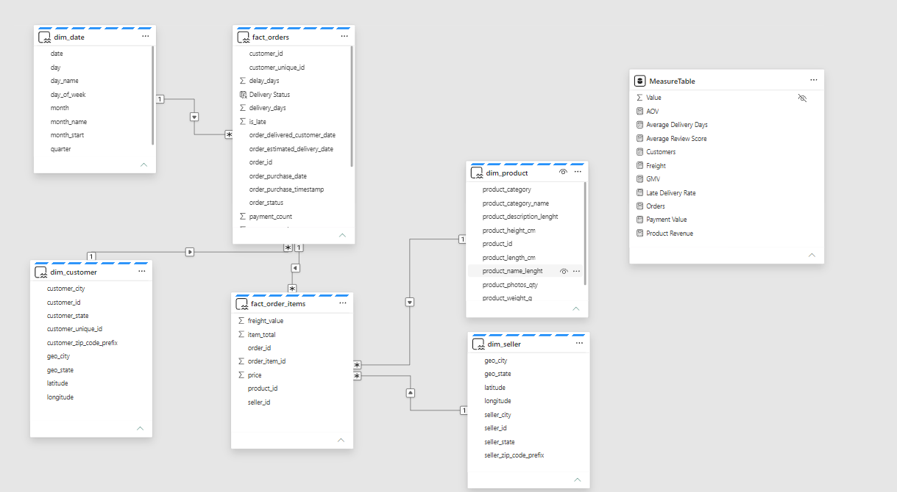
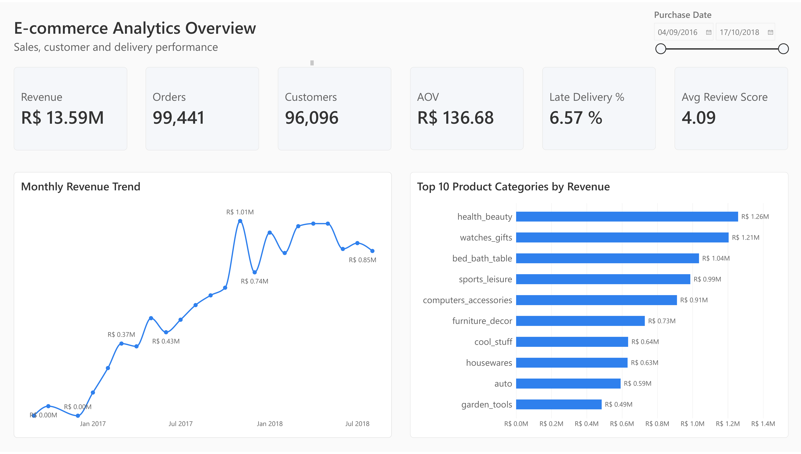
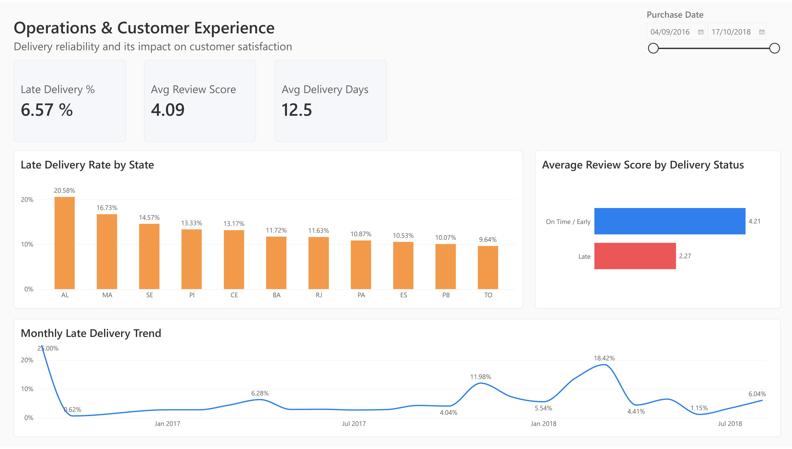

# Analytics Modernization with Azure & Microsoft Fabric

End-to-end analytics engineering project using Azure Data Lake Storage Gen2, Microsoft Fabric Lakehouse, PySpark, Direct Lake, and Power BI.

## Architecture


## Project Overview
This project modernizes a multi-table e-commerce dataset into a layered analytics platform using Azure Data Lake Storage Gen2 and Microsoft Fabric.

The solution uses ADLS Gen2 as the landing zone, a OneLake Shortcut for virtualized access, PySpark notebooks for Bronze/Silver/Gold processing, Fabric Data Pipeline for orchestration, and a Direct Lake semantic model for Power BI.

## Technology Stack
- Azure Data Lake Storage Gen2
- Microsoft Fabric Lakehouse
- OneLake Shortcuts
- PySpark
- Delta Lake
- Fabric Data Pipeline
- SQL Analytics Endpoint
- Direct Lake
- Power BI
- Git / GitHub

## Data Flow
1. Raw Olist CSV files land in ADLS Gen2.
2. Fabric accesses the external files through a OneLake Shortcut.
3. Bronze ingests the source data into Delta tables.
4. Silver cleans, standardizes, validates, and enriches the data.
5. Gold builds analytical fact and dimension tables.
6. Fabric Pipeline orchestrates the three notebook stages.
7. A Direct Lake semantic model exposes Gold data to Power BI.

## Notebooks

- [01 - Bronze Ingestion](notebooks/01_bronze_ingestion.ipynb)  
  Configuration-driven ingestion from ADLS Gen2 via OneLake Shortcut, including special handling for multi-line review data.

- [02 - Silver Transformations](notebooks/02_silver_transformations.ipynb)  
  Data cleaning, enrichment, geographic standardization, and grain-preserving transformations.

- [03 - Gold Modeling](notebooks/03_gold_modeling.ipynb)  
  Dimensional modeling, fact construction, date dimension creation, and validation for analytics consumption.

## Medallion Architecture

### Bronze
Raw ingestion with source-faithful structure and ingestion metadata.

Key work:
- Configuration-driven ingestion of nine source files
- CSV schema inference and validation
- Handling quoted multi-line review comments
- Persisting source data as Delta tables

### Silver
Cleaning, standardization, enrichment, and grain validation.

Key work:
- Derived delivery and delay metrics
- Product category translation and fallback logic
- Geographic standardization by ZIP prefix
- Customer and seller geographic enrichment
- Preservation of order-item and payment grain
- Data quality and join validation

### Gold
Analytics-ready dimensional modeling.

Key work:
- Built `fact_orders` and `fact_order_items`
- Built `dim_customer`, `dim_product`, `dim_seller`, and `dim_date`
- Canonical review selection
- Order-level payment aggregation
- Customer identity handling using `customer_unique_id`

## Key Engineering Decisions

### External landing zone with OneLake Shortcut
Raw source files are stored in ADLS Gen2. Fabric accesses them using a OneLake Shortcut rather than creating another copy of the raw files.

### Grain-first modeling
Each dataset was profiled to identify its row-level grain and key before joins were introduced. This prevented accidental row multiplication when combining orders, items, payments, reviews, customers, products, and geography.

### Review parsing and canonicalization
The review dataset contains quoted multi-line text fields. CSV ingestion was configured to correctly handle multi-line records. Because some orders contain multiple review records, a canonical review was selected per order using the earliest review response timestamp instead of averaging potentially duplicated scores.

### Geography standardization
ZIP prefixes can map to multiple city/state combinations. The most frequently observed city/state was selected as the representative location, and latitude/longitude averages were calculated only from records matching that selected geography.

### Payment modeling
Payments were aggregated at order grain and kept in `fact_orders` rather than joining order-level payment totals into the item-grain fact, which would have duplicated payment values across order items.

### Customer identity
`customer_id` is used as the relationship key between orders and the customer dimension, while `customer_unique_id` is used for unique-customer measures because the same shopper can appear under multiple order-specific customer IDs.

## Orchestration


The Fabric Data Pipeline runs the notebooks sequentially:

`01_bronze_ingestion → 02_silver_transformations → 03_gold_modeling`

Retries and timeouts were configured for notebook activities, and the full pipeline was validated with successful end-to-end execution.

## Semantic Model


The semantic model uses Direct Lake over Gold Delta tables.

Core relationships:
- `dim_date → fact_orders`
- `dim_customer → fact_orders`
- `fact_orders → fact_order_items`
- `dim_product → fact_order_items`
- `dim_seller → fact_order_items`

A dedicated measure table contains DAX measures for:
- Orders
- Unique Customers
- Product Revenue
- Payment Value
- AOV
- Freight
- GMV
- Late Delivery Rate
- Average Review Score
- Average Delivery Days

## Power BI Report

### Executive Overview


The overview page summarizes:
- Revenue
- Orders
- Unique customers
- AOV
- Late delivery rate
- Average review score
- Monthly revenue trend
- Top product categories by revenue

### Operations & Customer Experience


The operations page focuses on:
- Late delivery rate
- Average delivery days
- Average review score
- Late delivery by state
- Review score by delivery status
- Monthly late-delivery trend

## Repository Structure

```text
analytics-modernization-fabric/
├── README.md
├── notebooks/
│   ├── 01_bronze_ingestion.ipynb
│   ├── 02_silver_transformations.ipynb
│   └── 03_gold_modeling.ipynb
├── docs/
│   ├── architecture.png
│   ├── pipeline.png
│   ├── semantic-model.png
│   ├── executive-overview.png
│   └── operations-customer-experience.png
└── .gitignore
```

## Dataset

The project uses the public Olist Brazilian E-commerce dataset, which contains approximately 100,000 orders across customers, orders, items, payments, reviews, products, sellers, geolocation, and category translation tables.


## What This Project Demonstrates

- End-to-end cloud analytics architecture
- Lakehouse and medallion design
- PySpark-based transformation workflows
- Dimensional modeling and grain-aware data design
- Data quality validation and join integrity checks
- Pipeline orchestration in Microsoft Fabric
- Direct Lake semantic modeling
- Power BI analytical reporting
- Version-controlled analytics project structure and documentation
